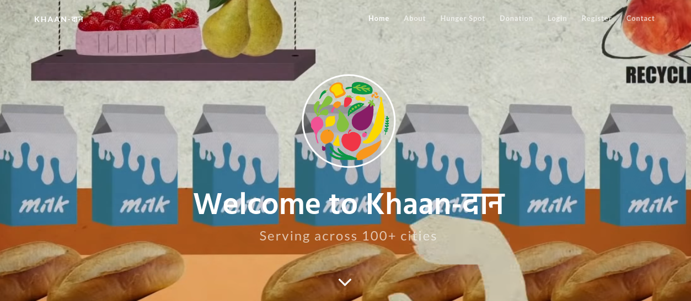
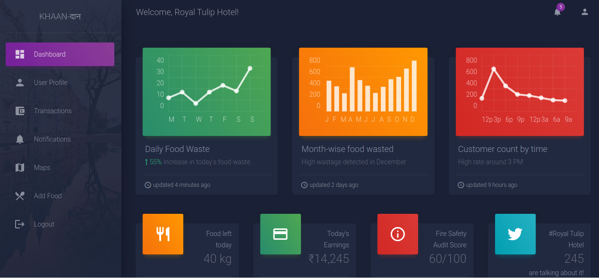
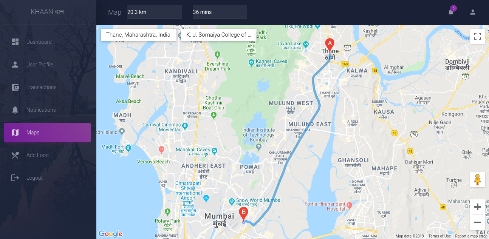
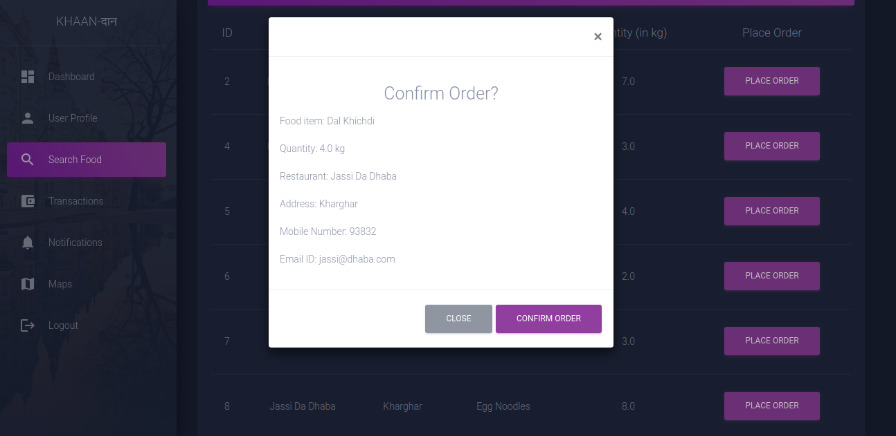
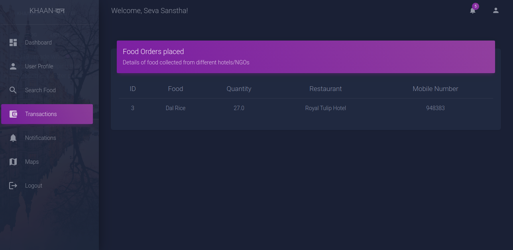

<h1 align="center">:fork_and_knife::rice: Khaan-दान :bread::ramen:</h1>

 

 

---

<h2>Motivation:</h2>

A lot of food is wasted on a daily basis at weddings, parties, restaurants, and hotels in India. India, being a poverty affected country, deals with tough situations to meet everyone's basic demands. India currently ranks 105 out of 117 countries, below all South-East Asian countries on global hunger and poverty index. To deal with the issue of food wastage and poverty, we aim to have these two issues juxtapose each other to become a solution. We aim to create a portal, where we will identify hotels and restaurants that deal with the issue of food wastage and also NGOs that work in the field of feeding the needy ones. This one-stop portal will help ease the process of connecting both these entities. The restaurants and hotels will be provided with statistics about weekly/monthly food wastage so that they can improve on food wastage.

### Goals of this project:

* [x] To connect hotels and NGOs on a common platform.
* [x] To provide a dashboard to NGOs and hotels/restaurants to help them keep track of their service/business.
* [x] To provide the hotels and NGOs with statistical graphs to help them identify any flaws and be up to date on everything going on in their service.
* [x] Give hotels and restaurants the ability to broadcast their excess food availability.
* [x] Give NGOs the functionality to book excess food online.
* [x] To show the hunger spots, so that it is easier for NGOs to reach out to these areas, once identified.
* [x] Provide interactive map feature to easily find out the distance and time required from a particular NGO to hotel or NGO to hunger spot using the Distance Matrix API by Google Maps.
* [x] Mobile-view support.

---

<h3 align="center">Khaan-दान as a webapp:</h3>

<h4 align="center">Homepage</h4>

 
<h4 align="center">Hunger Spots</h4>

 
<h4 align="center">Dashboard</h4>

 
<h4 align="center">Notifications</h4>

 
<h4 align="center">Distance and Time finder</h4>

 
<h4 align="center">NGOs placing order for excess food</h4>

 
<h4 align="center">Food collection History</h4>

 

---

### Future scope of this project:

* [ ] Adding a food estimator feature, which will enable hotels and restaurants to predict how much food they need to make based on previous data of food generated and wasted.
* [ ] Adding a donation page for crowdsourcing this project. (Form creation)
* [ ] Share your birthday feature, whereby, the users can decide to celebrate their birthday by donating food to the kids in partnership with some NGO. (Form creation)
* [ ] Add forgot/reset password feature.
* [ ] Ability to add and update profile picture. 
* [ ] Allow partial food ordering for NGOs.
* [ ] Send real time notifications to hotels and NGOs whenever there's a food order placed, or when excess food is advertised.

### Tech Stack of this Project:

* Frontend: HTML, CSS, SCSS, JS, Bootstrap4
* Backend: Python3
* Framework: Django
* Database: MongoDB
* Dependencies: GMaps API (specifically, Places API and Distance Matrix API)
* Libraries: Available in [requirements.txt](https://github.com/zenilharia26/KhaanDaan/blob/master/requirements.txt).

### To run the project:

* [Fork](https://github.com/zenilharia26/KhaanDaan) this Repository.
* Change into he directory in the terminal and run as:
  -`pip3 install -r requirements.txt`
  -`python3 manage.py runserver`
* Open your web browser and enter the following URL:
`localhost:8000`

#### To access the Admin Panel:
* Open terminal and type:
`python3 manage.py createsuperuser`
* Enter the desired credentials and remember them.
* Open the browser and go the address: `localhost:8000/admin`
* Enter the following credentials:
  - username : ** set-by-you **
  - password : ** set-by-you **

#### This project still has scope of development, so you can also contribute to this Project as follows:
* [Fork](https://github.com/zenilharia26/KhaanDaan) this Repository.
* Clone your Fork on a different branch:
	* `git clone -b <name-of-branch> https://github.com/zenilharia26/KhaanDaan.git`
* After adding any feature:
	* Goto your fork and create a pull request.
	* We will test your modifications and merge changes.

This project was done `as a part of our Web Technology Lab.`

---
<h3 align="center"><b>Developed with :heart: by <a href="https://github.com/zenilharia26">Zenil Haria</a>, <a href="https://github.com/arghyadeep99">Arghyadeep Das</a> and <a href="https://github.com/adityak14">Aditya Kaushik</a>.</b></h1>
